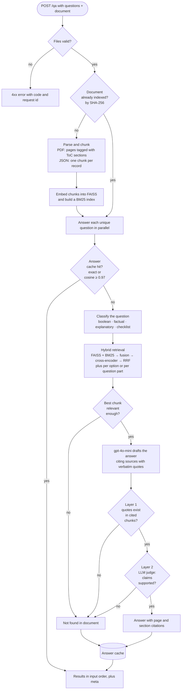

# grc-doc-qa

A question-answering API for compliance documents. Upload a list of questions and a document (a SOC 2 report as PDF, or a security knowledge base as JSON), and get back an answer for each question, grounded in the document, with page-level citations. If the document doesn't support an answer, the API says `"Not found in document"` instead of guessing.

Built with FastAPI, LangChain, FAISS, and `gpt-4o-mini`.

- [Quickstart](#quickstart)
- [API](#api)
- [How it works](#how-it-works)
- [Configuration](#configuration)
- [Testing](#testing)
- [Design decisions and trade-offs](#design-decisions-and-trade-offs)
- [Limitations](#limitations)
- [What I'd do next](#what-id-do-next)

## Quickstart

You need an OpenAI API key. The service only calls `gpt-4o-mini`; embeddings and reranking run locally.

### Docker (recommended)

```bash
cp .env.example .env          # then set OPENAI_API_KEY in .env
docker compose up --build     # first build downloads CPU torch and two small models (a few minutes)
```

Open http://localhost:8000 for the UI, or http://localhost:8000/docs for the interactive API docs.

Without compose:

```bash
docker build -t grc-doc-qa .
docker run --rm -p 8000:8000 -e OPENAI_API_KEY="$OPENAI_API_KEY" grc-doc-qa
```

### Local

Requires Python 3.11+.

```bash
python -m venv .venv && source .venv/bin/activate
pip install -e ".[dev]"
cp .env.example .env          # then set OPENAI_API_KEY
uvicorn app.main:app --reload
```

The first start downloads the embedding and reranking models (~200 MB) from the Hugging Face hub.

## API

### `POST /qa`

`multipart/form-data` with two files:

| Field       | Content                                                    |
|-------------|------------------------------------------------------------|
| `questions` | JSON array of question strings                             |
| `document`  | PDF, or JSON (records, pandas-style tables, or text lists) |

```bash
curl -s -X POST http://localhost:8000/qa \
  -F "questions=@tests/fixtures/sample_questions.json" \
  -F "document=@tests/fixtures/nave_soc2.pdf" | jq
```

Response (abridged):

```json
{
  "results": [
    {
      "question": "Which cloud providers do you rely on?",
      "answer": "The service is hosted on Google Cloud Platform (GCP).",
      "citations": [
        {
          "page": 17,
          "section": "3.4 Third Party Access:",
          "excerpt": "GCP Cloud hosting provider Infrastructure Vulnerability Management"
        }
      ]
    },
    {
      "question": "Which of the following, if any, are performed as part of your monitoring process for the service?\n- Application Performance Monitoring (APM)\n- End User Monitoring (EUM)\n- Digital Experience Monitoring (DEM)",
      "answer": "Application Performance Monitoring (APM): Yes, ...\nEnd User Monitoring (EUM): Not found in document\nDigital Experience Monitoring (DEM): Not found in document",
      "citations": [{ "page": 25, "section": "5.21 Monitoring Controls", "excerpt": "..." }],
      "items": [
        { "item": "Application Performance Monitoring (APM)", "answer": "Yes, ...", "citations": [{ "page": 25, "excerpt": "..." }] },
        { "item": "End User Monitoring (EUM)", "answer": "Not found in document", "citations": [] },
        { "item": "Digital Experience Monitoring (DEM)", "answer": "Not found in document", "citations": [] }
      ]
    }
  ],
  "meta": {
    "request_id": "5f0c...",
    "latency_ms": 9120,
    "questions": 5,
    "unique_questions": 5,
    "index_cache_hit": false,
    "answer_cache_hits": 0,
    "usage": { "llm_calls": 10, "input_tokens": 21450, "output_tokens": 1320, "estimated_cost_usd": 0.004 }
  }
}
```

#### Schema extensions

The required schema (`results[].question`, `answer`, `citations[].page`, `citations[].excerpt`) is unchanged. These optional fields were added, and fields that don't apply are omitted:

| Field                      | When present                                                                  |
|----------------------------|-------------------------------------------------------------------------------|
| `citations[].section`      | PDF has a table of contents; the section the excerpt comes from               |
| `citations[].source_id`    | JSON documents: the id of the knowledge-base record (JSON has no pages)       |
| `results[].items`          | "Which of the following…" questions: a verdict and citations for each option. If no option applies, `answer` and `citations` describe what the document does say instead of "Not found" |
| `results[].error`          | That one question failed (e.g. LLM timeout); the rest of the request succeeds |
| `meta`                     | Always: request id, latency, cache hits, LLM calls, tokens, estimated cost    |

Every citation excerpt is copied from the document itself, never from the model's output.

#### Errors

Errors share one shape: `{"error": {"code", "message", "request_id"}}`.

| Status | `code`                                                        | Cause                                                |
|--------|---------------------------------------------------------------|------------------------------------------------------|
| 413    | `file_too_large`                                              | Document > 20 MB, or questions file > 256 KB         |
| 413    | `request_too_large`                                           | Whole request body over the combined limit           |
| 415    | `invalid_file_type`                                           | Not PDF/JSON, or the extension doesn't match content |
| 422    | `invalid_questions`, `too_many_questions`                     | Malformed questions file, empty, or > 50 questions   |
| 422    | `document_parse_error`, `empty_document`, `document_too_long` | Corrupt/encrypted PDF, scanned PDF, > 500 pages      |
| 422    | `invalid_request`                                             | A form field is missing                              |
| 500    | `internal_error`                                              | Unexpected failure; details are logged, not returned |
| 502    | `upstream_unavailable`                                        | The LLM failed for every question after retries      |
| 503    | `service_misconfigured`                                       | `OPENAI_API_KEY` missing or rejected                 |
| 504    | `processing_timeout`                                          | Request exceeded 120 s                               |

### Other endpoints

- `GET /` is the minimal UI
- `GET /health` is the liveness check
- `GET /docs` is the OpenAPI UI

## How it works



- **Indexing** happens once per document. Repeat uploads of the same file skip straight to answering.
- **Classification** uses heuristics first. gpt-4o-mini is only asked when no rule matches, and none of the sample questions need it.
- **Checklist questions** ("which of the following…") retrieve evidence for each option, and each option is answered and verified on its own. If no option applies, the question is re-asked as an open question, so the answer can say what the document does describe instead of a bare "Not found".
- **Multi-part questions** ("…? What are your SLAs?", "X, as well as Y") retrieve evidence for each part as well as the whole.
- **The relevance gate** uses the cross-encoder's score. Questions the document clearly can't answer never reach the LLM.
- **Citations** come from the document itself. The model cites sources by label, and page, section and excerpt are filled in from the indexed chunk, so the model can't invent a page number.

Normally that's two LLM calls per question: one to answer and one to judge.

## Configuration

All settings are environment variables (or `.env`); defaults are in [`app/core/config.py`](app/core/config.py).

| Variable                          | Default                                | Purpose                                     |
|-----------------------------------|----------------------------------------|---------------------------------------------|
| `OPENAI_API_KEY`                  | required                               | Only used for `gpt-4o-mini`                 |
| `MAX_DOCUMENT_BYTES`              | 20 MB                                  | Upload limit                                |
| `MAX_QUESTIONS`                   | 50                                     | Questions per request                       |
| `MAX_PDF_PAGES`                   | 500                                    | Page limit                                  |
| `REQUEST_TIMEOUT_S`               | 120                                    | End-to-end budget per request               |
| `LLM_TIMEOUT_S` / `LLM_MAX_RETRIES` | 30 / 2                               | Per-call timeout and retries                |
| `MAX_CONCURRENCY`                 | 5                                      | Questions processed in parallel             |
| `MIN_RELEVANCE`                   | 0.0005                                 | Retrieval gate for skipping the LLM         |
| `ANSWER_CACHE_SIMILARITY`         | 0.97                                   | Semantic cache threshold                    |
| `LOG_LEVEL`                       | INFO                                   |                                             |

Logs are JSON lines on stdout. Each line carries the `request_id`, which is also returned in the `X-Request-ID` header. One line per question records how it was handled: classifier path, retrieval relevance, faithfulness outcome, cache hit, tokens and latency. One line per request adds totals and estimated cost.

## Testing

```bash
pip install -e ".[dev]"
pytest
```

The suite (~160 tests) runs offline in under a minute, with no API key and no model downloads. The LLM is replaced by a scripted fake, and the embedding and reranking models by deterministic token-based stand-ins, wired in through the same dependency-injection points production uses. Tests cover:

- **Unit:** validation, PDF structure recovery, JSON shapes, chunking, fusion and ranking, both faithfulness layers, classifier rules, caches, logging, the LLM client's error mapping, and synthesis.
- **Pipeline:** the full per-question flow, including a fabricated quote (rejected by Layer 1), a real quote attached to an overreaching claim (rejected by Layer 2), partial failures, and cache hits.
- **Integration:** HTTP tests against the real Nave SOC 2 PDF and the knowledge-base JSON, plus every error path.

### Evals

```bash
python -m evals.retrieval_eval             # retrieval quality on 38 labelled questions: free, no API key
python -m evals.retrieval_eval --answers   # full answers with gpt-4o-mini (~$0.01 per run; needs OPENAI_API_KEY)
```

Tests check behaviour; the eval measures quality. [`evals/soc2_retrieval.json`](evals/soc2_retrieval.json) holds 38 questions over the sample SOC 2 report: the five spec samples, 25 more worded the way questionnaires ask, and 8 on topics the report never mentions (ISO 27001, RTO/RPO, GDPR, SAML...). Each answerable question is labelled with short verbatim evidence phrases rather than page numbers, so the labels survive chunking changes, and the five samples also have target answers with must-mention / must-not-mention checks. Current results (answer metrics over three runs):

| Metric | Result |
|---|---|
| Evidence reaches the model (context recall) / MRR, 30 answerable | 0.867 / 0.708 |
| Answerable questions wrongly stopped by the relevance gate | 0 |
| Unanswerable questions stopped by the gate, before any LLM call | 5 / 8 |
| Answerable questions answered, citing an evidence page | 24–26 / 30 |
| Unanswerable questions answered "Not found" | 7–8 / 8 (an occasional miss is an honest partial answer, e.g. "SAML isn't mentioned, but SSO is enforced") |
| Sample questions meeting their target answer | 3–4 / 5 (see Limitations) |

## Design decisions and trade-offs

The guiding principle: a fluent answer the document doesn't support is the worst possible output for a compliance product, worse than "Not found", because a reviewer is likely to trust it. Where coverage and grounding conflicted, I chose grounding, and made each check verifiable rather than relying on prompt wording.

- **Two-layer verification.** Layer 1 (deterministic, free) checks that each verbatim quote the model gives appears in the chunk it cites; Layer 2 (one gpt-4o-mini call) asks a judge whether the claims are supported by those excerpts. Layer 1 catches invented quotes, Layer 2 catches a real quote attached to an overreaching claim, and a rejection is final. Re-drafting rejected answers and asking the judge twice were both tried and dropped: the first turned correct "Not found"s into misleading "No…" answers, the second made no measurable difference.
- **Hybrid retrieval with fused ranking.** Questionnaires hinge on exact terms ("AES-256", "CC6.1", vendor names) that dense retrieval blurs, so BM25 runs alongside FAISS, and a cross-encoder reranks the fused candidates. The final order is a reciprocal-rank fusion of the retriever and reranker orders, because the reranker alone sometimes buried the chunk both retrievers agreed on.
- **A relevance gate.** Below a cross-encoder score of `MIN_RELEVANCE = 5e-4` a question gets "Not found" with no LLM call; on the sample report, unrelated questions scored below 1e-4 and answerable ones above 2e-3. Near-misses pass the gate and the model answers "Not found" itself.
- **Local embeddings and reranker.** Only `gpt-4o-mini` is allowed, so `bge-small-en-v1.5` and `ms-marco-MiniLM-L-6-v2` run locally on CPU: no embedding cost or rate limits, at the price of a ~2.5 GB image and slower first-time indexing.
- **Question routing.** Heuristics classify questions (boolean, factual, explanatory, checklist) without an LLM call, and the type sets the answer format and retrieval depth. Checklist questions retrieve and verify each option separately, so one unsupported option doesn't discard the others; multi-part questions retrieve for each part.
- **Structure from the real files.** PDF sections come from the table of contents and running headers are stripped; JSON knowledge-base records are the retrieval units, cited by record id. Document text is treated as untrusted, and Layer 1 means injected text can't be cited as something the document doesn't say.
- **Avoiding redundant work.** Each document is indexed once, keyed by content hash. Duplicate questions are answered once, near-identical ones (cosine ≥ 0.97) come from a semantic cache, and answers are cached for an hour (errors never), so a re-run questionnaire gets consistent answers.
- **Clear failure boundaries.** Questions run concurrently (5 at a time), with CPU-bound work in threads. A missing or rejected API key fails the whole request (503); a transient LLM failure affects only that question (`results[].error`), and the request returns 502 only if every question fails.

## Limitations

- **Two sample questions have known gaps.** The incident-notification answer is partial and misses the report's closest statement (p.21: "Nave will inform all necessary parties of the incident without undue delay"): the question says "notifying a client", the report says "inform… parties", and neither a larger embedding model, HyDE nor parent-document retrieval brought that chunk into context. It is also "Not found" in roughly a third of runs: some judge rejections are misreadings, and some are correct, because it cites a risk-management excerpt as evidence for "defined incident-response roles" (see the next point). The personal-information answer is hedged ("may involve…") and is "Not found" in about half of runs: its "Yes" is inferred from the vendor list, and the judge correctly rejects that. The report does say it on p.16 ("Data is persisted in GCP Storage"), but that chunk isn't in the question's top 20.
- **Test-matrix tables are chunked as text.** Fixed-size chunks can cut SOC 2 test-matrix rows in half or mix unrelated controls, which is why the incident-notification answer sometimes cites the wrong row. Table-aware chunking (cells rebuilt from PDF word positions, one chunk per control) is on the [`experiment/table-aware-chunking`](https://github.com/sidreddy88/grc-doc-qa/tree/experiment/table-aware-chunking) branch: on the eval it raised context recall from 0.867 to 0.967, but met fewer sample targets (0–1 of 5) until retrieval is re-tuned for it, so it isn't merged.
- **No OCR.** Scanned PDFs are rejected with a clear error, and text inside images isn't read. For the sample report that doesn't matter: the p.15 architecture diagram was checked by hand, and its facts (GCP components, no region) also appear in the prose.
- **First request per document pays for indexing:** about 10 s for the 84-page sample natively on an Apple Silicon Mac, about 50 s in Docker on the same machine (the Linux ARM torch build lacks Apple's Accelerate kernels). Large documents on slow hosts may need a higher `REQUEST_TIMEOUT_S`.
- **In-memory caches and indexes**, so one uvicorn worker per container.
- **Thresholds come from one document.** The gate and cache thresholds were set on the sample report, and the eval covers only it.

## What I'd do next

- **Grow the eval** to 60–100 questions, including the JSON knowledge base, with content checks for every question, and score the runtime judge against a stronger offline one. Then run it in CI: retrieval metrics on every push, answer metrics on prompt or model changes.
- **Finish table-aware chunking** on its branch: re-tune retrieval depth and the gate for it with the eval, and store rows as structured fields so "were there exceptions for CC6.1?" becomes a lookup.
- **Read diagrams:** describe each figure once at index time with gpt-4o-mini's vision input, stored as a figure chunk with its page and verified separately, since the verbatim-quote check can't apply to a model-written description.
- **Persist indexes and caches** (pgvector, Redis) so they survive restarts and scale across workers, and add a `/metrics` endpoint for latency, LLM calls and cache hit rates.

## Project structure

```
app/
  api/          HTTP layer: route, schemas, upload handling
  core/         config, domain exceptions, error handlers, JSON logging, middleware
  services/     document loading, chunking, indexing, retrieval, classification,
                synthesis, faithfulness, caches, LLM client, pipeline orchestration
  deps.py       dependency wiring
static/         minimal UI
tests/          unit/, integration/, fakes.py (model and LLM doubles), fixtures/
evals/          labelled questions and the retrieval/answer eval (python -m evals.retrieval_eval)
```
