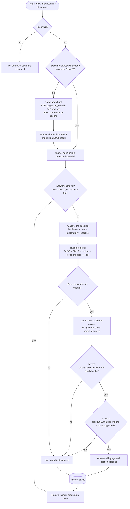

# grc-doc-qa

A question-answering API for compliance documents. Upload a list of questions and a document (a SOC 2 report as PDF, or a security knowledge base as JSON), and get back an answer for each question, grounded in the document, with page-level citations. If the document doesn't support an answer, the API says `"Not found in document"` instead of guessing.

Built with FastAPI, LangChain, FAISS, and `gpt-4o-mini`.

- [Quickstart](#quickstart)
- [API](#api)
- [How it works](#how-it-works)
- [Configuration](#configuration)
- [Testing](#testing)
- [Design decisions and trade-offs](#design-decisions-and-trade-offs) (details in [NOTES.md](NOTES.md))
- [Limitations](#limitations)

## Quickstart

You need an OpenAI API key. The service only calls `gpt-4o-mini`; embeddings and reranking run locally.

### Docker (recommended)

```bash
cp .env.example .env          # then set OPENAI_API_KEY in .env
docker compose up --build     # first build downloads CPU torch and two small models (a few minutes)
```

Open http://localhost:8000 for the UI, or http://localhost:8000/docs for the interactive API docs.

Without compose:

```bash
docker build -t grc-doc-qa .
docker run --rm -p 8000:8000 -e OPENAI_API_KEY="$OPENAI_API_KEY" grc-doc-qa
```

### Local

Requires Python 3.11+.

```bash
python -m venv .venv && source .venv/bin/activate
pip install -e ".[dev]"
cp .env.example .env          # then set OPENAI_API_KEY
uvicorn app.main:app --reload
```

The first start downloads the embedding and reranking models (~200 MB) from the Hugging Face hub.

## API

### `POST /qa`

`multipart/form-data` with two files:

| Field       | Content                                                    |
|-------------|------------------------------------------------------------|
| `questions` | JSON array of question strings                             |
| `document`  | PDF, or JSON (records, pandas-style tables, or text lists) |

```bash
curl -s -X POST http://localhost:8000/qa \
  -F "questions=@tests/fixtures/sample_questions.json" \
  -F "document=@tests/fixtures/nave_soc2.pdf" | jq
```

Response (abridged):

```json
{
  "results": [
    {
      "question": "Which cloud providers do you rely on?",
      "answer": "The service is hosted on Google Cloud Platform (GCP).",
      "citations": [
        {
          "page": 17,
          "section": "3.4 Third Party Access:",
          "excerpt": "GCP Cloud hosting provider Infrastructure Vulnerability Management"
        }
      ]
    },
    {
      "question": "Which of the following, if any, are performed as part of your monitoring process for the service?\n- Application Performance Monitoring (APM)\n- End User Monitoring (EUM)\n- Digital Experience Monitoring (DEM)",
      "answer": "Application Performance Monitoring (APM): Yes, ...\nEnd User Monitoring (EUM): Not found in document\nDigital Experience Monitoring (DEM): Not found in document",
      "citations": [{ "page": 25, "section": "5.21 Monitoring Controls", "excerpt": "..." }],
      "items": [
        { "item": "Application Performance Monitoring (APM)", "answer": "Yes, ...", "citations": [{ "page": 25, "excerpt": "..." }] },
        { "item": "End User Monitoring (EUM)", "answer": "Not found in document", "citations": [] },
        { "item": "Digital Experience Monitoring (DEM)", "answer": "Not found in document", "citations": [] }
      ]
    }
  ],
  "meta": {
    "request_id": "5f0c...",
    "latency_ms": 9120,
    "questions": 5,
    "unique_questions": 5,
    "index_cache_hit": false,
    "answer_cache_hits": 0,
    "usage": { "llm_calls": 10, "input_tokens": 21450, "output_tokens": 1320, "estimated_cost_usd": 0.004 }
  }
}
```

#### Schema extensions

The required schema (`results[].question`, `answer`, `citations[].page`, `citations[].excerpt`) is unchanged. These optional fields were added, and fields that don't apply are omitted:

| Field                      | When present                                                                  |
|----------------------------|-------------------------------------------------------------------------------|
| `citations[].section`      | PDF has a table of contents; the section the excerpt comes from               |
| `citations[].source_id`    | JSON documents: the id of the knowledge-base record (JSON has no pages)       |
| `results[].items`          | "Which of the following…" questions: a verdict and citations for each option   |
| `results[].error`          | That one question failed (e.g. LLM timeout); the rest of the request succeeds |
| `meta`                     | Always: request id, latency, cache hits, LLM calls, tokens, estimated cost    |

Every citation excerpt is copied from the document itself, never from the model's output.

#### Errors

Errors share one shape: `{"error": {"code", "message", "request_id"}}`.

| Status | `code`                                                        | Cause                                                |
|--------|---------------------------------------------------------------|------------------------------------------------------|
| 413    | `file_too_large`, `request_too_large`                         | Document > 20 MB, questions file > 256 KB            |
| 415    | `invalid_file_type`                                           | Not PDF/JSON, or the extension doesn't match content |
| 422    | `invalid_questions`, `too_many_questions`                     | Malformed questions file, empty, or > 50 questions   |
| 422    | `document_parse_error`, `empty_document`, `document_too_long` | Corrupt/encrypted PDF, scanned PDF, > 500 pages      |
| 422    | `invalid_request`                                             | A form field is missing                              |
| 502    | `upstream_unavailable`                                        | The LLM failed for every question after retries      |
| 503    | `service_misconfigured`                                       | `OPENAI_API_KEY` missing or rejected                 |
| 504    | `processing_timeout`                                          | Request exceeded 120 s                               |

### Other endpoints

- `GET /` is the minimal UI
- `GET /health` is the liveness check
- `GET /docs` is the OpenAPI UI

## How it works



- **Indexing** happens once per document. Repeat uploads of the same file skip straight to answering.
- **Classification** uses heuristics first. gpt-4o-mini is only asked when no rule matches, and none of the sample questions need it.
- **Checklist questions** ("which of the following…") retrieve evidence for each option, and each option is answered and verified on its own.
- **The relevance gate** uses the cross-encoder's score. Questions the document clearly can't answer never reach the LLM.
- **Citations** come from the document itself. The model cites sources by label, and page, section and excerpt are filled in from the indexed chunk, so the model can't invent a page number.

Normally that's two LLM calls per question: one to answer and one to judge.

## Configuration

All settings are environment variables (or `.env`); defaults are in [`app/core/config.py`](app/core/config.py).

| Variable                          | Default                                | Purpose                                     |
|-----------------------------------|----------------------------------------|---------------------------------------------|
| `OPENAI_API_KEY`                  | required                               | Only used for `gpt-4o-mini`                 |
| `MAX_DOCUMENT_BYTES`              | 20 MB                                  | Upload limit                                |
| `MAX_QUESTIONS`                   | 50                                     | Questions per request                       |
| `MAX_PDF_PAGES`                   | 500                                    | Page limit                                  |
| `REQUEST_TIMEOUT_S`               | 120                                    | End-to-end budget per request               |
| `LLM_TIMEOUT_S` / `LLM_MAX_RETRIES` | 30 / 2                               | Per-call timeout and retries                |
| `MAX_CONCURRENCY`                 | 5                                      | Questions processed in parallel             |
| `MIN_RELEVANCE`                   | 0.0005                                 | Retrieval gate for skipping the LLM         |
| `ANSWER_CACHE_SIMILARITY`         | 0.97                                   | Semantic cache threshold                    |
| `LOG_LEVEL`                       | INFO                                   |                                             |

Logs are JSON lines on stdout. Each line carries the `request_id`, which is also returned in the `X-Request-ID` header. One line per question records how it was handled: classifier path, retrieval relevance, faithfulness outcome, cache hit, tokens and latency. One line per request adds totals and estimated cost.

## Testing

```bash
pip install -e ".[dev]"
pytest
```

The suite (~150 tests) runs offline in about 15 seconds, with no API key and no model downloads. The LLM is replaced by a scripted fake, and the embedding and reranking models by deterministic token-based stand-ins, wired in through the same dependency-injection points production uses. Tests cover:

- **Unit:** validation, PDF structure recovery, JSON shapes, chunking, fusion and ranking, both faithfulness layers, classifier rules, caches, logging, the LLM client's error mapping, and synthesis.
- **Pipeline:** the full per-question flow, including a fabricated quote (rejected by Layer 1), a real quote attached to an overreaching claim (rejected by Layer 2), partial failures, and cache hits.
- **Integration:** HTTP tests against the real Nave SOC 2 PDF and the knowledge-base JSON, plus every error path.

## Design decisions and trade-offs

Short version below. [NOTES.md](NOTES.md) has the reasoning, the alternatives considered, and what I'd build next (including evals).

- **Grounding over coverage.** For a compliance product, a confident wrong answer is worse than "Not found". Every answer must survive two independent checks: quotes verified against the source text, then an LLM judge. That costs an extra LLM call per answered question, and I think that's the right trade here.
- **Hybrid retrieval with reranking.** Questionnaires hinge on exact terms (vendor names, "AES-256", "CC6.1") that dense retrieval alone can miss, so BM25 runs alongside FAISS. A cross-encoder then reranks the fused candidates. Its absolute score also serves as the "is anything relevant?" gate.
- **Local embeddings.** The service uses `gpt-4o-mini` only, so embeddings (`bge-small-en-v1.5`) and reranking (`ms-marco-MiniLM-L-6-v2`) run locally on CPU. The cost is a larger image (~2.5 GB, with CPU-only torch and the model weights baked in).
- **Question routing.** Checklist questions ("which of the following…") are retrieved and answered per option. Heuristics route most questions without an LLM call.
- **Avoiding redundant work.** Each document is parsed and embedded once, keyed by content hash. Duplicate questions are answered once. Near-identical questions on the same document are served from a semantic cache. Unanswerable questions never reach the LLM.
- **Clear failure boundaries.** A missing or rejected API key fails the whole request (503). A transient LLM failure affects only that question (`results[].error`).

## Limitations

- No OCR. Scanned PDFs are rejected with a clear error, and text inside images (this sample's architecture diagram and org chart) isn't read. For the sample report that doesn't matter, because the same facts appear in the prose.
- The first request for a new document pays for indexing: about 10 s for the 84-page sample running natively on an Apple Silicon Mac, and about 50 s inside Docker on the same machine (the Linux ARM torch build lacks Apple's Accelerate kernels). Repeat requests hit the cache. Large documents on slow hosts may need a higher `REQUEST_TIMEOUT_S`.
- Caches and indexes live in process memory, so one uvicorn worker per container. Horizontal scaling would move them to Redis or a vector store.
- Table structure is flattened to text. Cells stay contiguous, which works well for SOC 2 test matrices, but column relationships aren't modeled.
- The retrieval gate and cache thresholds were calibrated on the sample documents, not on an eval set. See NOTES.md.

## Project structure

```
app/
  api/          HTTP layer: route, schemas, upload handling
  core/         config, domain exceptions, error handlers, JSON logging, middleware
  services/     document loading, chunking, indexing, retrieval, classification,
                synthesis, faithfulness, caches, LLM client, pipeline orchestration
  deps.py       dependency wiring
static/         minimal UI
tests/          unit/, integration/, fakes.py (model and LLM doubles), fixtures/
```
